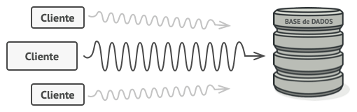
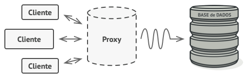
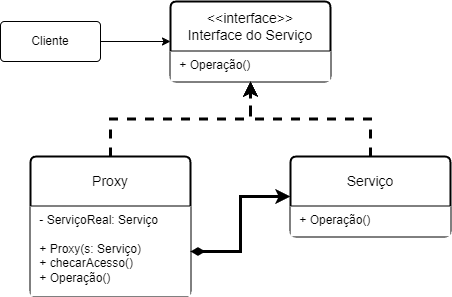

# Desing Pattern: **Proxy**

## Qual é a função do **Proxy**?

O **Proxy** é um padrão de projeto estrutural que permite que você forneça um substituto ou um espaço reservado para outro objeto. Um proxy controla o acesso ao objeto original, permitindo que você faça algo ou antes ou depois do pedido chegar ao objeto original.





## Código exemplo de um **Proxy**

```Typescript
/**
 * A interface Subject declara operações comuns tanto para RealSubject como para 
 * o Proxy. Desde que o cliente trabalhe com RealSubject utilizando esta 
 * interface, poderá passar-lhe um proxy em vez de um sujeito real.
 */
interface Subject {
    request(): void;
}

/**
 * Normalmente, os RealSubjects são capazes de fazer alguns trabalhos úteis que
 * também podem ser muito lentos ou sensíveis - por exemplo, corrigir dados de 
 * entrada. Um Proxy pode resolver estes problemas sem quaisquer alterações ao
 * código do RealSubject.
 */
class RealSubject implements Subject {
    public request(): void {
        console.log('RealSubject: Handling request.');
    }
}

/**
 * O Proxy tem uma interface idêntica à do RealSubject.
 */
class ProxySubject implements Subject {
    private realSubject: RealSubject;

    /**
     * O Proxy mantém uma referência ao objeto da classe RealSubject. Este 
     * objeto pode ser carregado sem esforço ou passado para o proxy pelo 
     * cliente.
     */
    constructor(realSubject: RealSubject) {
        this.realSubject = realSubject;
    }

    /**
     * As aplicações mais comuns do padrão Proxy são Lazy Loading, o Caching, o 
     * controlo do acesso, o logging etc. Um Proxy pode realizar uma destas 
     * coisas e depois, dependendo do resultado, passar a execução para o mesmo 
     * método num objeto ligado ao RealSubject.
     */
    public request(): void {
        if (this.checkAccess()) {
            this.realSubject.request();
            this.logAccess();
        }
    }

    private checkAccess(): boolean {
        // Algumas verificaçõoes de verdade viriam aqui.
        console.log('Proxy: Checking access prior to firing a real request.');

        return true;
    }

    private logAccess(): void {
        console.log('Proxy: Logging the time of request.');
    }
}

/**
 * O código do cliente é foi feito para trabalhar com todos os objetos (tanto 
 * Subjects como Proxies) através da interface Subject, de modo a suportar tanto 
 * Real Subjects como Proxies. No entanto, na vida real, os clientes trabalham 
 * diretamente com os seus objetos reais. Neste caso, para implementar o padrão 
 * mais facilmente, você pode estender seu proxy a partir da classe do Real
 * Subject.
 */
function clientCode(subject: Subject) {
    // ...

    subject.request();

    // ...
}

console.log('Client: Executando o código do cliente com o Real Subject:');
const realSubject = new RealSubject();
clientCode(realSubject);

console.log('');

console.log('Client: Executanco o mesmo cliente com uma Proxy:');
const proxy = new ProxySubject(realSubject);
clientCode(proxy);
```

## Diagrama de Classe


